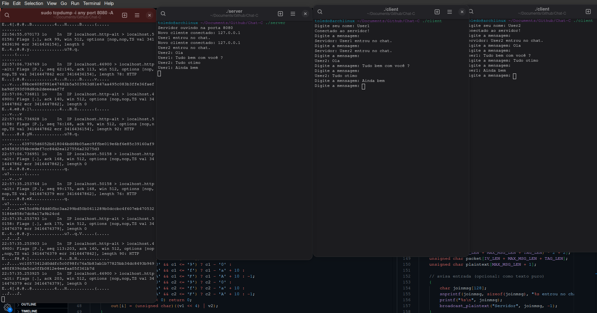
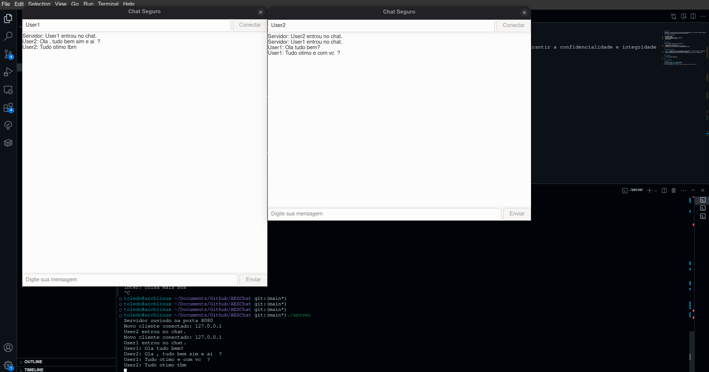

# AESChat 🔐💬

**AESChat** é um projeto simples de chat cliente-servidor implementado em C, que utiliza criptografia **AES-256-GCM** para garantir a confidencialidade e integridade das mensagens. O projeto foi desenvolvido com fins educacionais.

## 🛠 Tecnologias Utilizadas

- C (pthreads, sockets)  
- OpenSSL (EVP, RAND)  
- AES-256-GCM (modo autenticado de criptografia)  
- Codificação/decodificação em HEX  
- Comunicação TCP  

---

## 🔒 Segurança

Todas as mensagens trocadas entre os clientes são:

- Criptografadas com **AES-256-GCM**  
- Protegidas contra alterações com **TAG de autenticação**  
- Transmitidas como **strings HEX** para compatibilidade com sockets  

---

## 📁 Estrutura do Projeto

- `server.c`: implementa o servidor multi-threaded que aceita conexões e retransmite mensagens criptografadas.  
- `client.c`: cliente que envia e recebe mensagens criptografadas.  
- Ambos compartilham uma **chave simétrica de 256 bits (32 bytes)** (apenas para fins de demonstração).  

---

## 📸 Screenshot

  

  


---

## 🚀 Como Compilar

```bash
gcc -o server server.c -lssl -lcrypto -lpthread
gcc -o client client.c -lssl -lcrypto -lpthread
# Compilar a interface gráfica chat_gui
gcc -o chat_gui client.c -lssl -lcrypto -lpthread `pkg-config --cflags --libs gtk+-3.0`